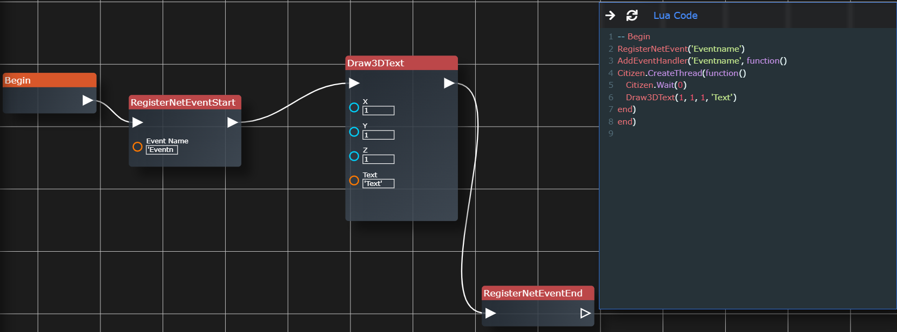

# Getting Started

> To get started with our Creation Platform you must understand the basics!
>   In order to Start you must add a Begin node, you can do this by Right-Clicking in the middle and Selecting "Begin".
>   No you can start Scripting! At First we recommend testing out our framework and see if you understand what is happening.   Experimenting is the best and funnest way to learn stuff! But looking up stuff or asking for help is obviously also recommended. You can also check out our Tutorials!

## Node Explanation

> Codelabbs uses a framework that runs on "Nodes". Nodes are basically boxes with information in them.  For example: <i>The Draw3DText Node will output</i>   <b>Citizen.CreateThread ㅤwhile true do ㅤㅤㅤCitizen.Wait(0) ㅤㅤㅤDraw3DText(0,0,0,"Text") ㅤend end)</b>  The nodes are all connected and so for example you put an Start Node first, then you put all the information in, and then you end it. Its all logically connected. 

# FiveM Natives

## Wait

> With Lua you get a Wait(amount) function, but with FiveM you get a Citizen.Wait() function.
>   As one might expect you use this function to add a timeout between point A and point B. This is also required for an infinite loop (while true do). <b>Otherwise you will Crash!</b>

## Draw3DText

> Create a Motion Text on specific coordinates. You can use these for inputs ("E - To Enter"). Or for a /me command. Possibilities are endless!  <b>Don't forget to add the 3DTextFunction otherwise it won't work!</b>

## CreateBlip

> To make Blips (Map Icons) you can just drag the CreateBlip node anywhere and it will work!  <b>Don't forget to add the CreateBlipFunction otherwise it won't work!</b>

## CreateThread

> To create new Threads (Functions that get run asynchronously) you need to drag the CreateThreadStart and CreateThreadEnd into your file, now you can start working on your Thread!

## RegisterNetEvent

> To create events it is pretty straight forward, you create the RegisterNetEventStart node and add the AddEventHandler Node and you can start making the Event.   <b>Don't forget to add RegisterNetEventStop!</b>

### AddEventHandler

> This is required for and Event to function!

## TriggerEvent

> To trigger an Event you can do 3 things. - <b>TriggerClientEvent()</b> : This must be inside of a Server Sided Script. - <b>TriggerServerEvent()</b> : This must be inside of a Client Sided Script - <b>TriggerEvent()</b> : This can be run in either Client/Server. And is used to call the event that is in the current type of script.   <i>Example: (Trigger Client Sided Event in a Client Script & Trigger Server Sided Event in a Server Script).</i>

## TriggerServerEvent

> Just like given above, this is for Trigger Server Sided Events from the Client Side.

# FiveM Natives Get

## GetPlayer

> To get the current player.  Returns: <i>player</i>

## GetDistance

> To get the current entities distance between specified coordinates  Returns: <i>for statment</i>

## GetEntityCoords

> To get the current entities coordinates  Returns: <i>entityCoords</i>
